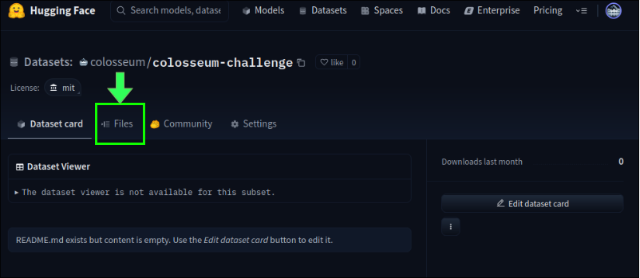
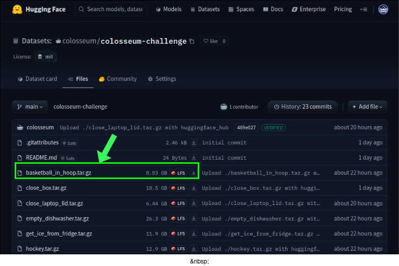
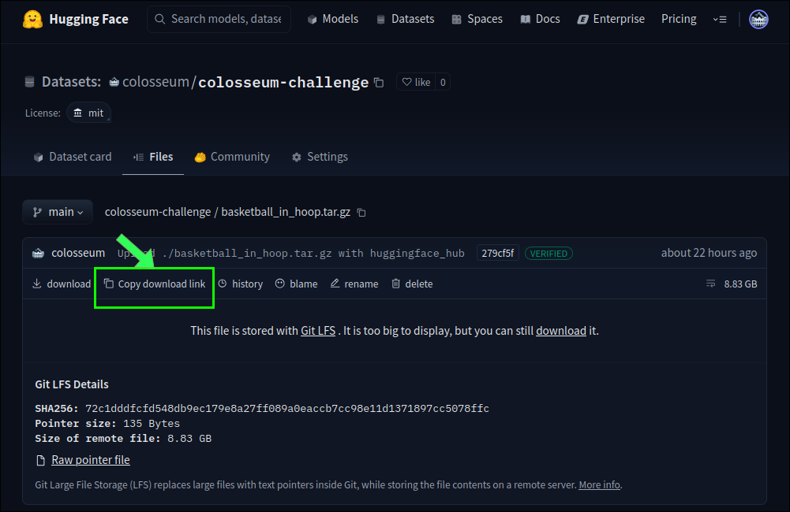

# Colosseum Challenge Dataset

The dataset for this challenge is hosted on [HuggingFace][0]. I consists of
various `tar` files containing the data for variations on each of the 20 tasks.

## Downloading the dataset using wget and a download link

1. Go to the HuggingFace repo and select the files option:



2. Select the task you want to get:



3. Get the download link:



4. Use `curl` or `wget` to get the tar file:

```bash
wget YOUR_DOWNLOAD_LINK
```


[0]: <https://huggingface.co/datasets/colosseum/colosseum-challenge/tree/main> (huggingface-dataset)
